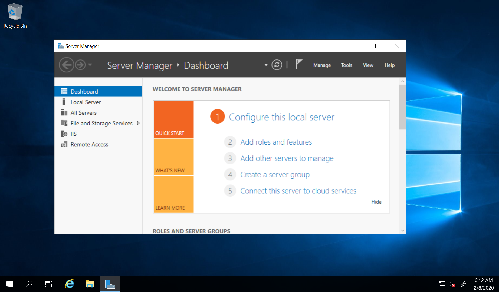

If you want to setup VPN on a remote Windows server mainly to change your IP address and security is not the main concern then PPTP VPN is probably the simplest option. In this guide we’ll see how to setup PPTP VPN with NAT on Windows Server 2019 with only a single network interface (as is the case with most VPS deployments).

<!--more-->

NAT normally requires two interfaces – one public and one private. Using the method given here you can setup VPN + NAT on a single interface as well. The rest of this tutorial assumes that you are setting this up on a cloud VPS with only 1 NIC.

To setup PPTP VPN go to Server Manager => Add roles and features. In Server Roles tab select “Remote Access” role and click through to the end of the wizard.

After the installation is complete go to Server Manager => Tools and select the Routing and Remote Access role:

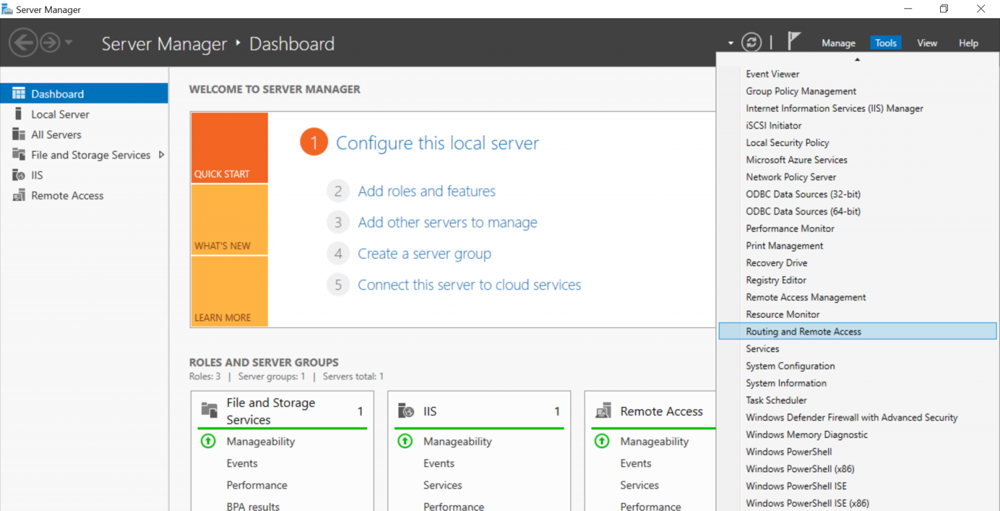

Right click on your server and select “Configure and Enable Routing and Remote Access”:

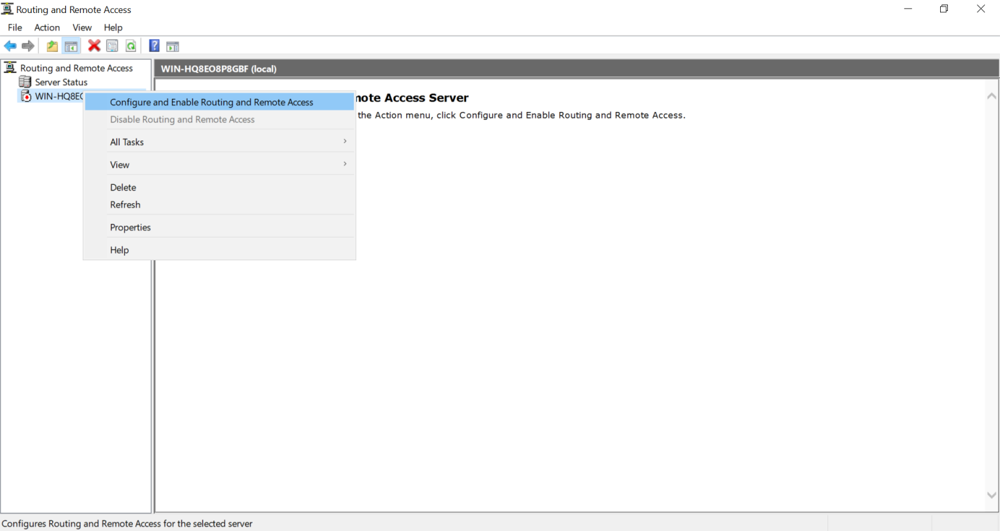

Press Next in the wizard welcome screen. Select Custom configuration option and press Next:

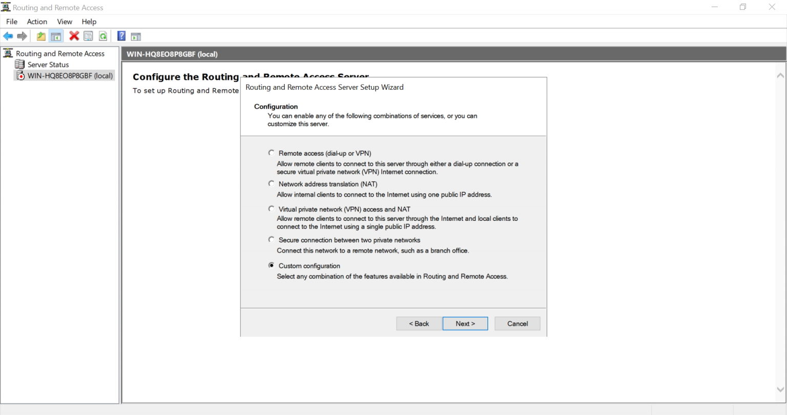

Check “VPN access” and “NAT” options and press Next:

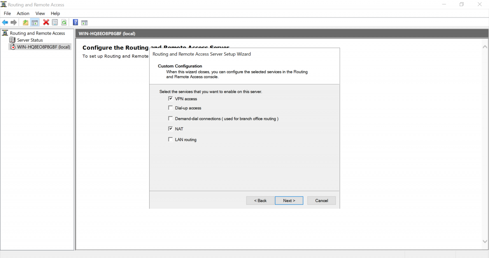

Finish the wizard and start the service:

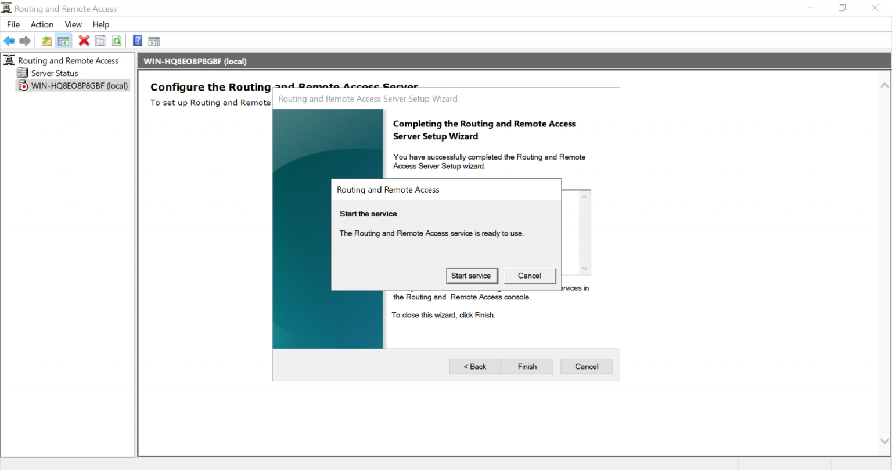

Right click on your server and select Properties. Go to IPv4 tab and select “Static address pool” option. Add a new IP pool and enter a range of private IPs (we have used 192.168.125.100 – 192.168.125.200):

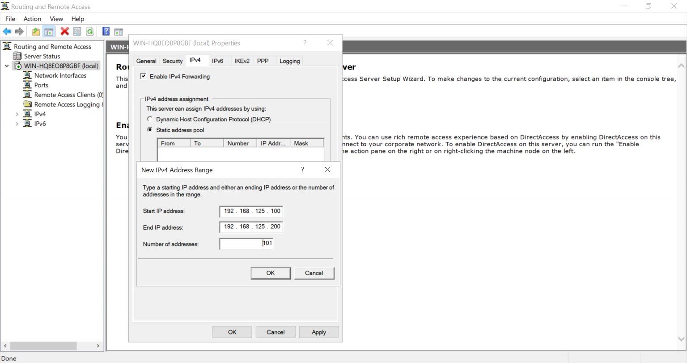

You need to configure an IP of the same range as a secondary IP on your network interface card. Go to Network and Sharing Center and select your network interface. Go to its Properties. Select “Internet Protocol Version 4 (TCP/IPv4)” and go to its properties. In the Advanced portion enter your secondary IP like this (we have used 192.168.125.1):

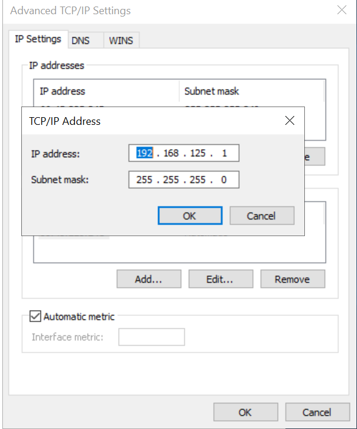

In Routing and Remote Access expand “IPv4” and right-click on NAT. Select “New Interface…”.

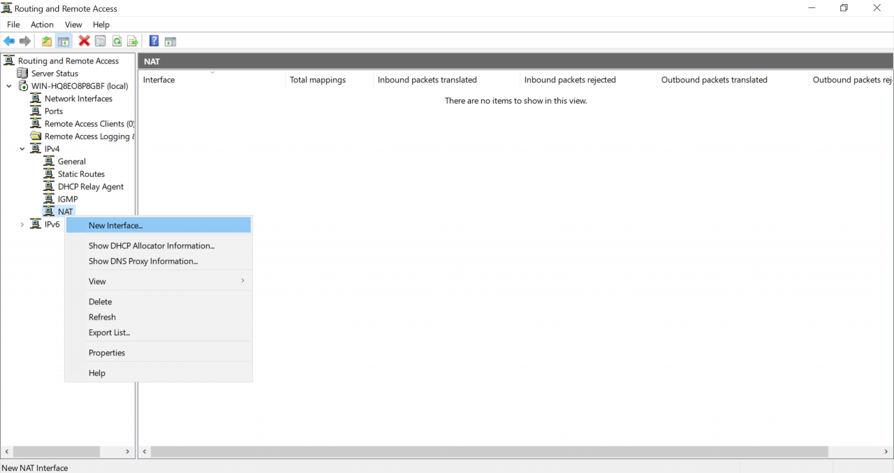

Select the interface with the public IP (and secondary private IP) and configure it as a public interface for NAT:

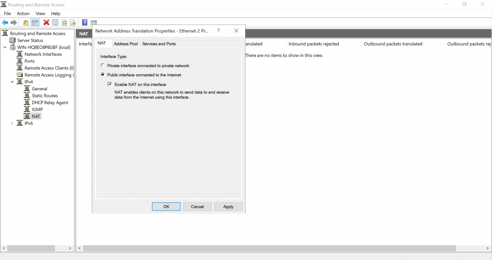

To create a local user for PPTP go to Computer Management => Local Users and Groups => Users. Right click on Users and add a new user by entering a username and password for it. Next, select that newly created user, right-click and go to Properties. In the Dial-in tab select “Allow access” under Network Access Permission:

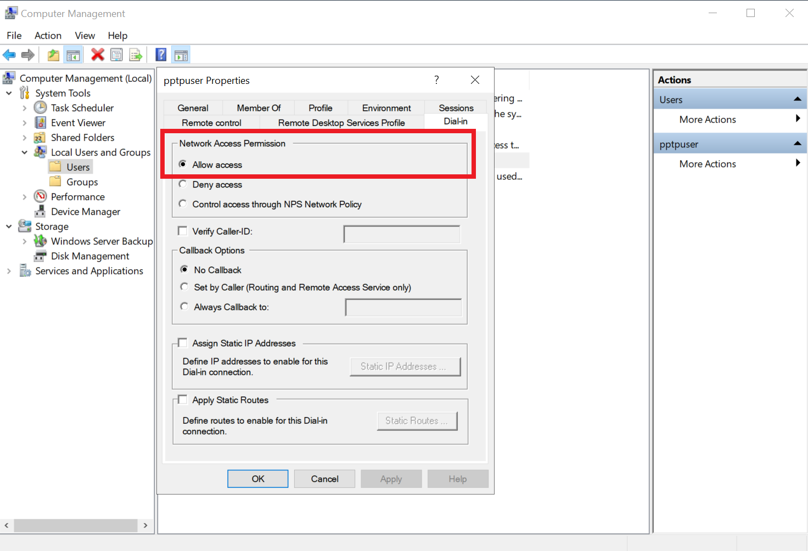

### Firewall Settings

PPTP VPN uses TCP port 1723 and GRE protocol. They have to be allowed in Firewall Inbound rules for PPTP to work. To manually allow them in the firewall go to Windows Defender Firewall with Advanced Security and select Inbound Rules. Right-click and select “New Rule…”. Create a rule for TCP port 1723:

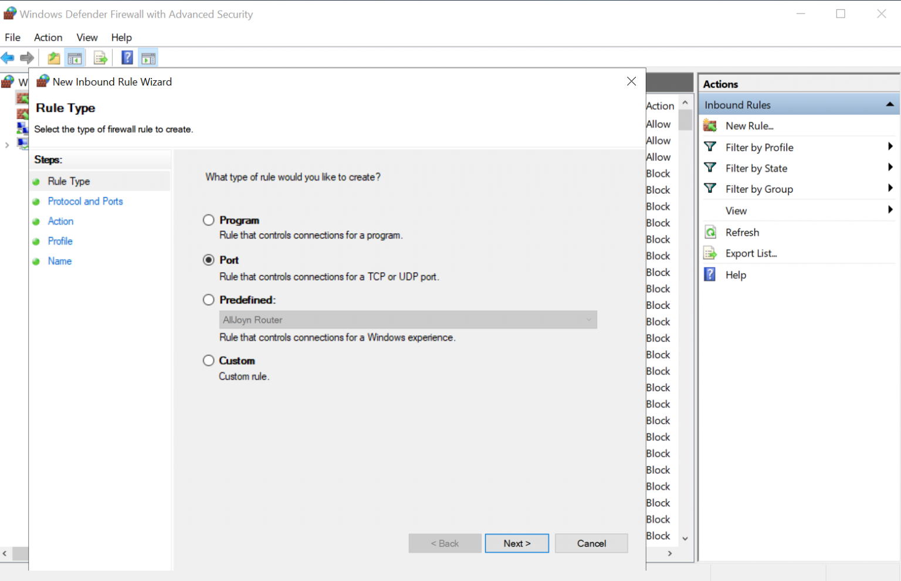

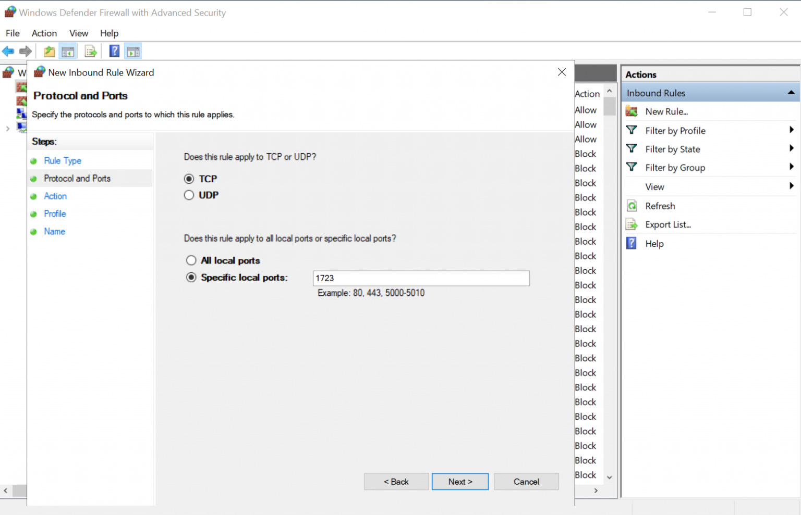

Click Next through the remaining options and enter a name for this rule at the end. Similarly create a rule to allow GRE traffic. Rule type will be Custom and GRE would be selected in “Procotol and Ports”:

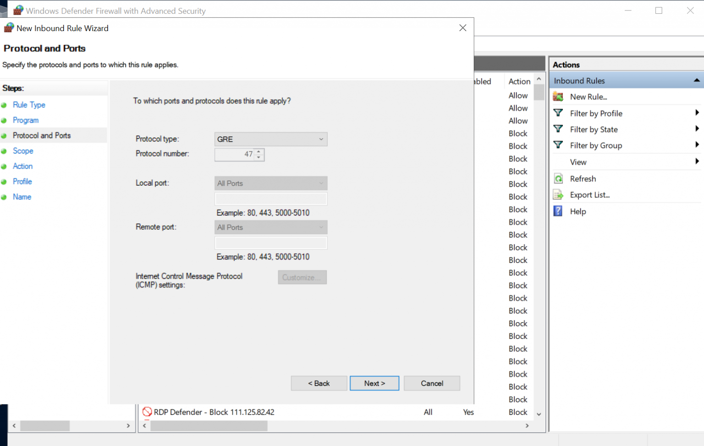

Our PPTP VPN setup is now complete.

### References

[How to Install VPN on Windows Server 2019](https://www.thomasmaurer.ch/2018/05/how-to-install-vpn-on-windows-server-2019/)