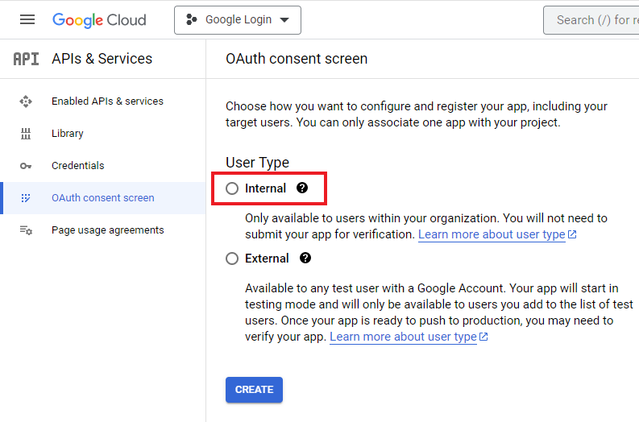
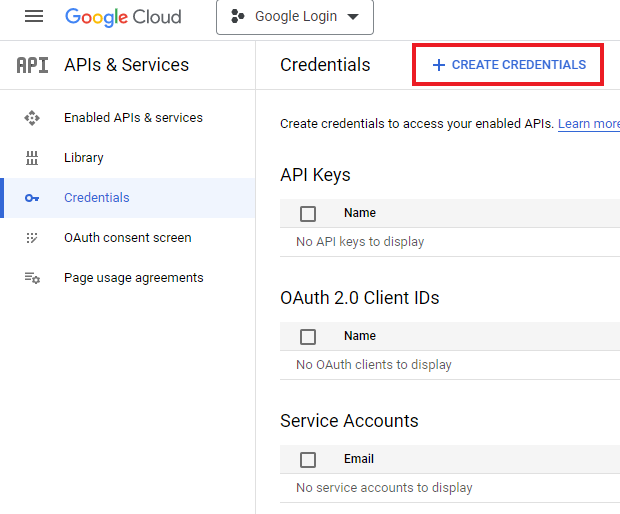

You can use the following steps for integrating Google Workspace login into your web application.

Go to [Google API Console](https://console.cloud.google.com/apis)

Select OAuth consent screen, and select the User Type *Internal*.

After clicking Create, enter information related to your application. Under App Information, enter *App name* and *User support email*. Under Authorized domains add your domain. Under Developer contact information add the email addresses that will receive notifications from Google.
On the next screen there is no need to change any scopes, so click on Save and Continue. Review the summary of what you entered.

Next, go to the Credentials section and click on Create Credentials.

In the dropdown, select *OAuth client ID*. Under Application type, select *Web Application*. In Authorized redirect URIs enter the URI where Google should redirect the user after successful login.

On the next screen, note your *Client ID* and *Client Secret* and store them securely.

After this you need to integrate Google login into your web application. There are libraries for various languages and frameworks that you can refer to. For PHP you can use [Google API PHP Client](https://github.com/googleapis/google-api-php-client).

### Reference

[Login with Google Account using PHP](https://www.codexworld.com/login-with-google-api-using-php/)