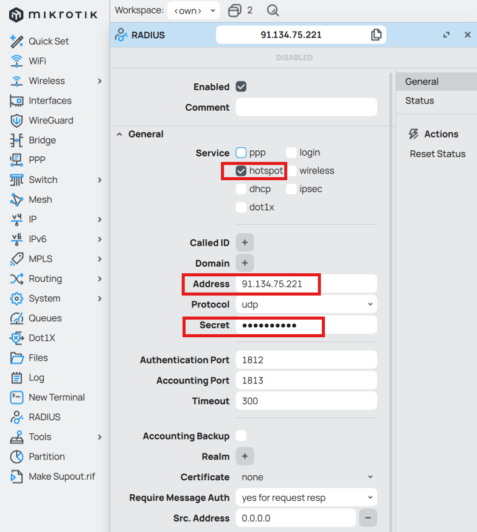
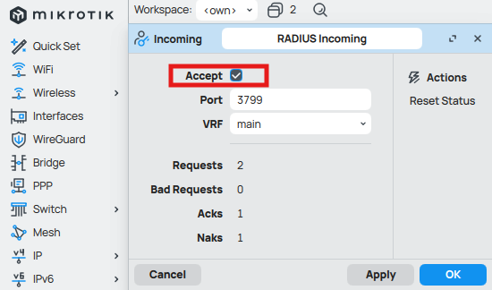
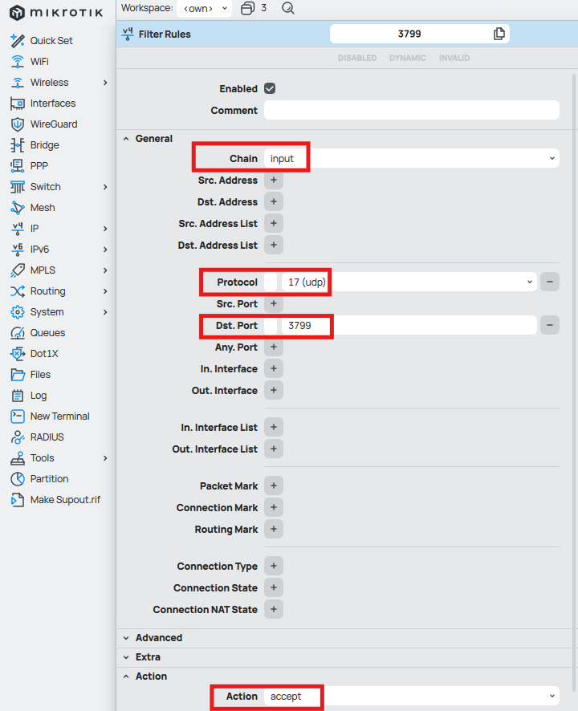

To trigger Change of Authorization (CoA) from FreeRADIUS to a Mikrotik router to update the session parameters of a hotspot user you can follow these steps:

Access the Mikrotik router via Winbox. Go to `RADIUS` to add a RADIUS server like this:



<!--more-->

Then click on Incoming and check the Accept option.



Create a firewall entry for `input` chain to allow incoming UDP port 3799 traffic (you can specify the IP address of your RADIUS server(s) in Src. Address).



On the FreeRADIUS server, create a file `coa` with the `User-Name` and `Framed-IP-Address` of the user you want to apply the change to. Suppose you want to update the `Session-Timeout` of this user:

```
User-Name := "D6:D8:C3:1E:BF:4F"
Framed-IP-Address := 192.168.88.253
NAS-IP-Address := 192.168.200.32
Session-Timeout := 3600
```

Then execute the CoA command like this:

```
root@Lenovo-i7:~# cat coa | radclient -x 192.168.200.32:3799 coa testing123
Sent CoA-Request Id 224 from 0.0.0.0:57226 to 192.168.200.32:3799 length 57
        User-Name := "D6:D8:C3:1E:BF:4F"
        Framed-IP-Address := 192.168.88.253
        NAS-IP-Address := 192.168.200.32
        Session-Timeout := 3600
Received CoA-ACK Id 224 from 192.168.200.32:3799 to 172.22.51.155:57226 length 38
        Message-Authenticator = 0x44697ff3ad17a89cb4ebe9df2684ee57
```