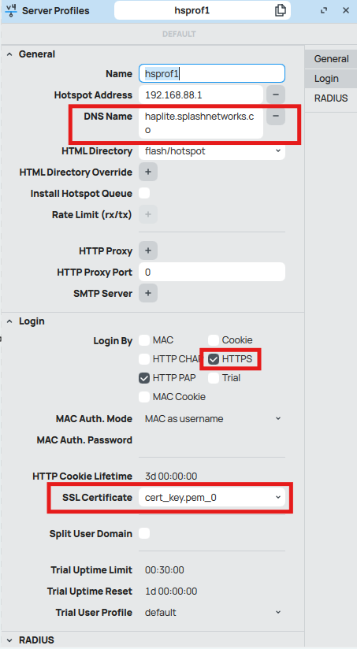
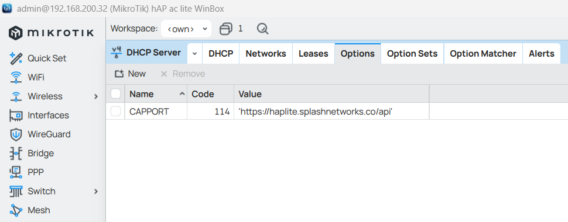
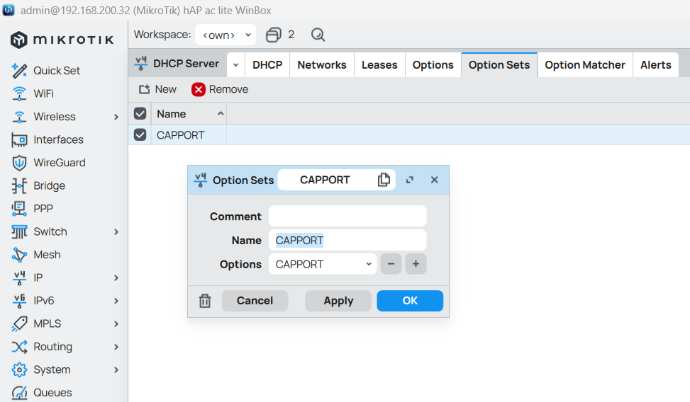
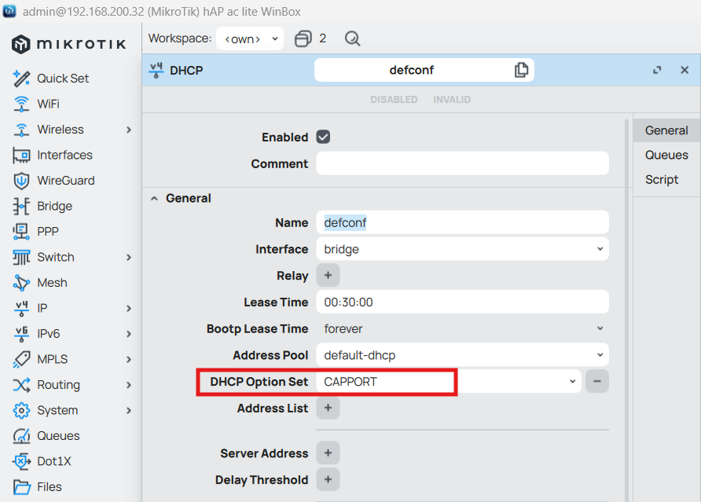
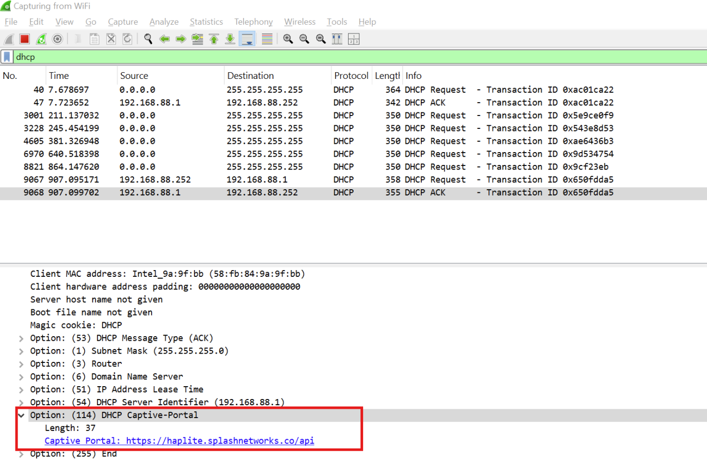
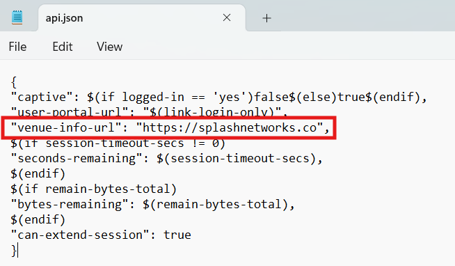
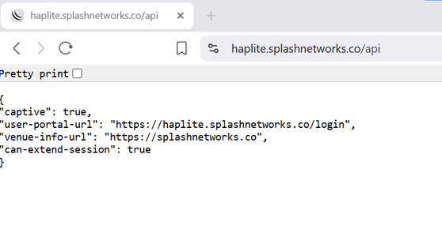
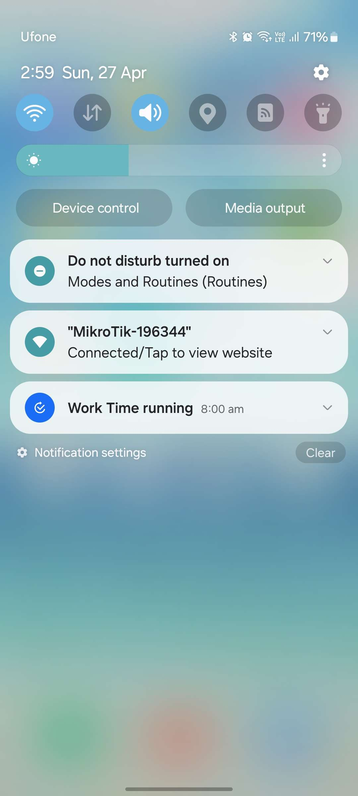
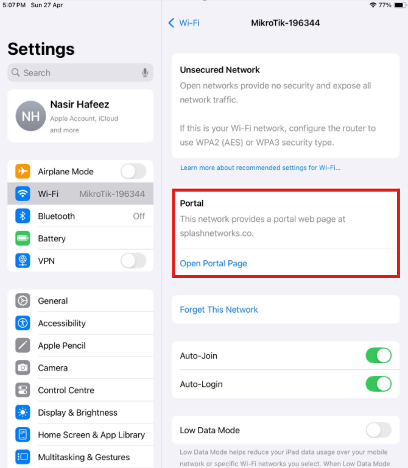

RFC 8910 specifies the use of DHCP Option 114 for captive portal identification. Using this DHCP option, endpoints can learn the address of the captive portal API server and contact it to find out the URL of the captive portal server.

To implement DHCP Option 114 on Mikrotik it needs to have a TLS certificate and a DNS hostname. We can get a TLS certificate for free using Let's Encrypt. To set it up refer to [this guide](https://docs.splashnetworks.co/portals/mikrotik-with-radius/#avoiding-browsing-warning-on-laptops).

After importing your certificate successfully you will need to enter a DNS name for your router (the corresponding DNS record should also exist and point to any of the interface IPs on Mikrotik). HTTPS should be selected in the Login By section. Additionally, in SSL certificate you will need to select your added certificate.

<div style="text-align: center;">
    
</div>

<!--more-->

To set up DHCP Option 114 go to IP -> DHCP Server -> Options. Enter a name for it. The code should be `114`. In Value enter your hostname like this:

```
'https://hostname/api'
```

Check the `Force` option and click Ok.



In Option Sets create a new Option Set and select the Option created in the previous step.



Go to DHCP tab and in the default settings select the Option Set created in the last step.



Mikrotik will now start to advertise DHCP Option 114. It can be seen in a packet capture.



The captive portal API endpoint on Mikrotik is managed by the `api.json` file located inside hotspot folder in Files. We can add a `venue-info-url` option to it by downloading the file and updating it like this:

<div style="text-align: center;">
    
</div>

We have added the following statement.

```
"venue-info-url": "https://splashnetworks.co",
```

The value of `venue-info-url` can be a URL which is used to share information regarding the venue or business with the user.

We will need to upload the updated file back to the router's hotspot directory.

To see the response we are getting from the API endpoint we can access it in a browser on a hotspot client:

<div style="text-align: center;">
    
</div>

Once the user is authorized the response will start showing `"captive": false`.

On Android a notification will be seen on the home screen. Clicking it will take the user to the URL specified in `venue-info-url`.

<div style="text-align: center;">
    
</div>

Similarly, on iOS a Portal section will appear in the Wi-Fi network's settings with a link to open the portal page.

