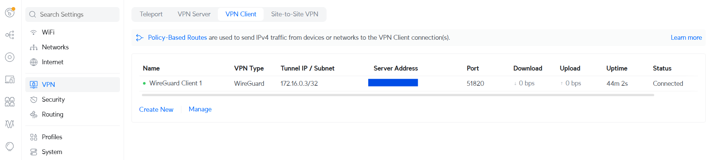
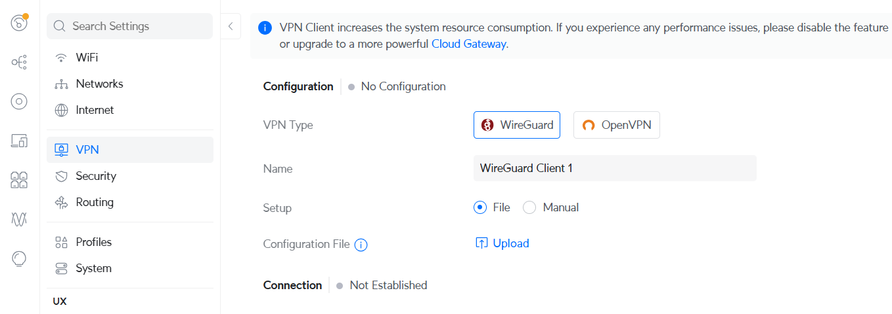
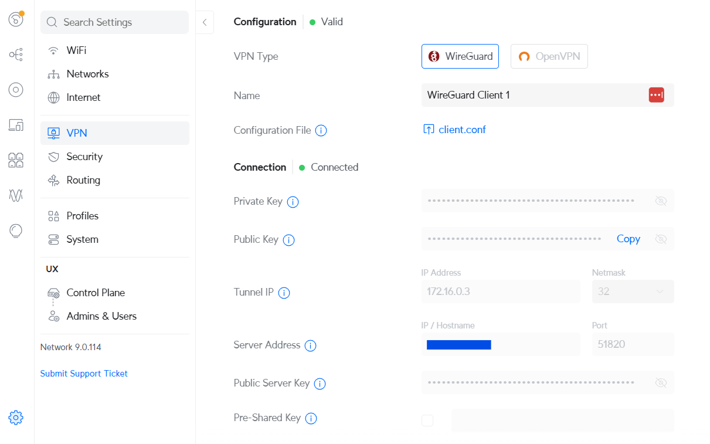
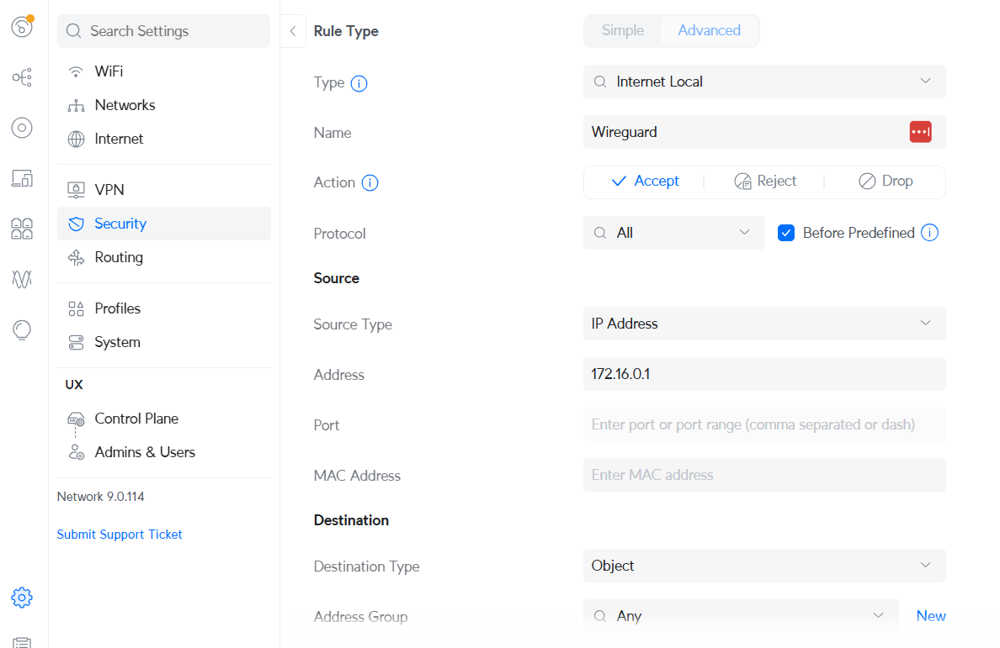

As a captive portal provider we often face the situation where a customer has a Unifi network which is behind a dynamic IP and NAT. An external captive portal needs to communicate with the Unifi controller via API in order to authorize guests. This requires a static public IP on the Unifi gateway device, which is often not available. To get around this situation, it's possible to set up a Wireguard client on the Unifi gateway device (such as UniFi Dream Machine, UniFi Express, UniFi Cloud Gateway etc.). This is a simpler solution compared to others such as Dynamic DNS (often a paid service) and port forwarding (might not be possible in all scenarios, such as CGNAT).

In this post we'll see how we can set up a Wireguard server on an Ubuntu machine and configure a Unifi gateway device as a Wireguard client.



<!--more-->

The Ubuntu server - which in our case is the external captive portal server which needs to be able to communicate with the Unifi gateway - will be set up as the Wireguard Server.

For reference, here is the IP scheme that we'll be using:

- WireGuard Server: 172.16.0.1
- UCG = WireGuard Client: 172.16.0.3
- Tunnel Network = 172.16.0.0/24
- Port = UDP/51820

**_On Ubuntu Server_**

Install Wireguard:

```
apt install wireguard -y
```

Generate keys for server and client:

```
wg genkey | tee wg-server.key | wg pubkey > wg-server.pub
wg genkey | tee client.key | wg pubkey > client.pub
```

- wg-server.key → Private key for Ubuntu server
- wg-server.pub → Public key for Ubuntu server
- client.key → Private key for Unifi client
- client.pub → Public key for Unifi client

Create server's config file:

```
nano /etc/wireguard/wg0.conf
```

Enter these details:

```
[Interface]
Address = 172.16.0.1/24
ListenPort = 51820
PrivateKey = <wg-server.key>

# Enable forwarding when tunnel is up
PostUp = iptables -A FORWARD -i wg0 -j ACCEPT;
PostDown = iptables -D FORWARD -i wg0 -j ACCEPT;

[Peer]
PublicKey = <client.pub>
AllowedIPs = 172.16.0.3/32
PersistentKeepalive = 25
```

Create client's config file:

```
nano client.conf
```

Enter these contents in it:

```
[Interface]
Address = 172.16.0.3/32
DNS = 8.8.8.8
PrivateKey = <client.key>

[Peer]
PublicKey = <wg-server.pub>
Endpoint = <ubuntu-public-ip>:51820
AllowedIPs = 172.16.0.1/32
PersistentKeepalive = 25
```

Start the Wireguard server `wg0` interface and enable it:

```
systemctl start wg-quick@wg0.service
systemctl enable wg-quick@wg0.service
```

View interface status:

```
wg show wg0
```

**_On Unifi Gateway_**

On Unifi gateway device go to Settings > VPN. **VPN Type** will be `Wireguard`. Upload the configuration file `client.conf` that was created earlier.



Upon connection its status should appear like this:



A firewall rule needs to be added to allow the server to communicate with the client. Go to Settings > Security and add an Advanced rule. Type should be `Internet Local` and should allow traffic from the source IP of `172.16.0.1` which is the Wireguard server's IP in our case.

