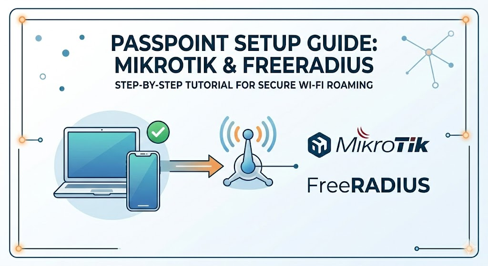
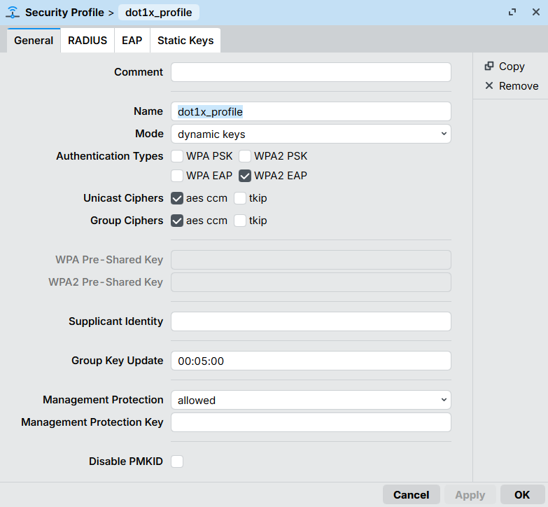
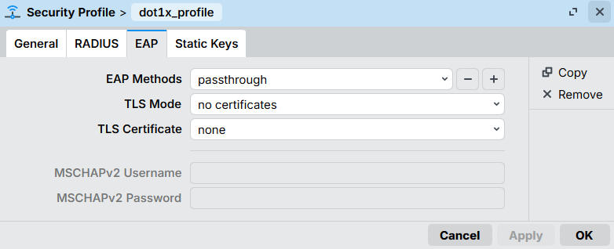
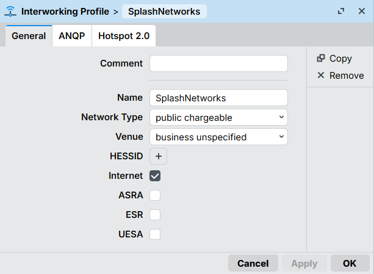
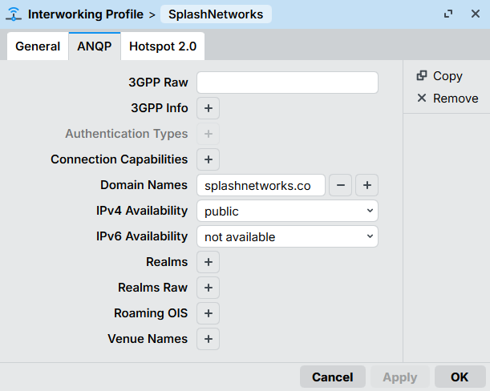
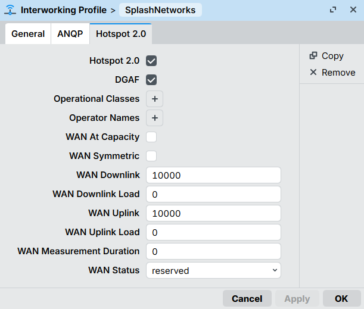
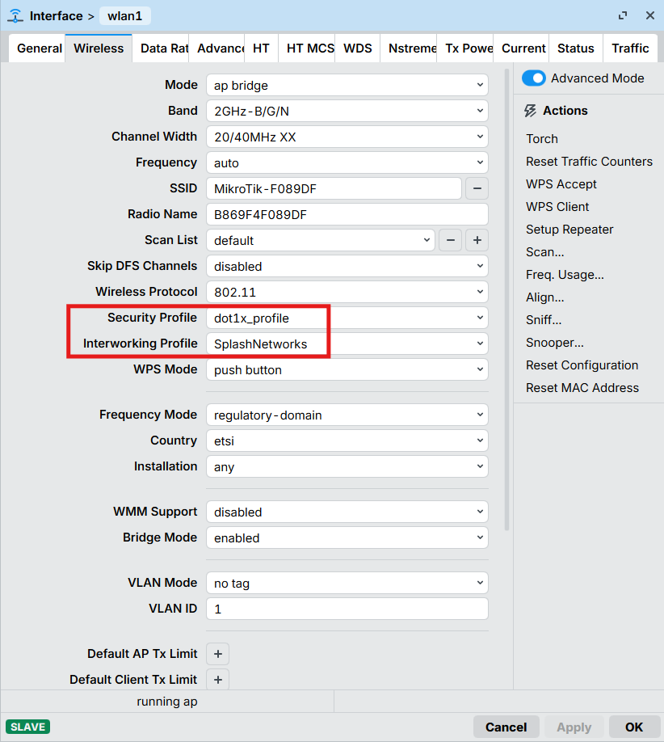
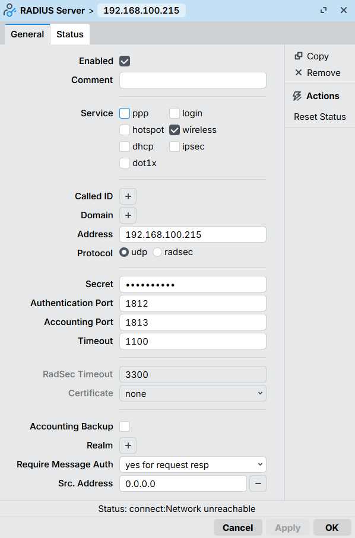
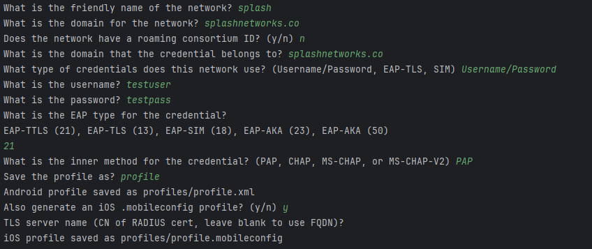
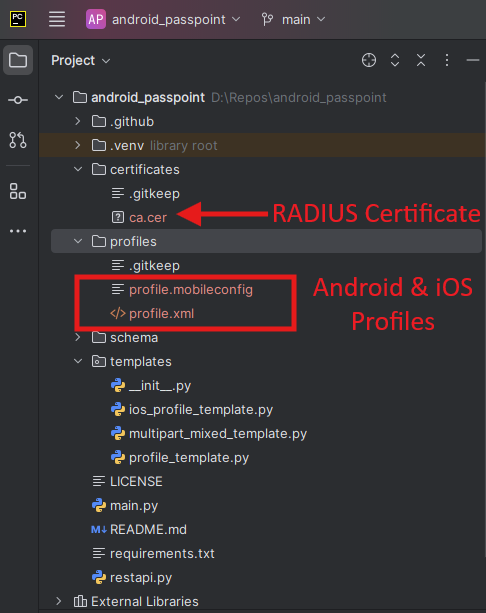

People are often wary of using public Wi‑Fi because it lacks security. Captive portals, open authentication, and shared passwords make public networks vulnerable and inconvenient.
Passpoint (Hotspot 2.0) solves this problem by enabling enterprise‑grade Wi‑Fi security while allowing users to connect automatically, without landing pages or manual login prompts.
In this guide, we configure Passpoint using MikroTik and FreeRADIUS, and then generate Passpoint profiles for Android and iOS. 



<!--more-->

A 802.11u supported MikroTik AP (Mikrotik cAP ac in our case) will work as a Passpoint (Hotspot 2.0) access point and forward authentication requests to the RADIUS server.

## Mikrotik Setup:

First we'll go to Wireless > Security Profiles and create a new Security Profile. These settings are configured:

 - **Mode**: dynamic keys
 - **Authentication Types**: WPA2 EAP

<div style="text-align: center;">
    
</div>

(Optional): Go to RADIUS tab and enable EAP accounting and Interim Updates if required.

In EAP tab use these settings:

 - **EAP Methos**: passthrough
 - **TLS Mode**: no certificates
 - **TLS Certificate**: none

<div style="text-align: center;">
    
</div>

Click Ok to save the profile. Then go to Wireless > Interworking Profile and create a new profile. Give it a name, select a Network and Venue Type and select Internet.

<div style="text-align: center;">
    
</div>

In ANQP (Access Network Query Protocol) we will define the domain name of this Passpoint network. The same domain name will be configured in the Passpoint profile which will be installed in Wi-Fi client devices. When the domain and settings match the device will be able to connect automatically. The configuration will be like this:

<div style="text-align: center;">
    
</div>

In Hotspot 2.0 tab we will enable Hotspot 2.0 and set WAN Downlink and WAN Uplink speeds (in kbps):

<div style="text-align: center;">
    
</div>

Next we will go to WiFi Interfaces and either create a new SSID or modify an existing SSID. We will select the Security Profile and Interworking Profile we created earlier.

<div style="text-align: center;">
    
</div>

Then we will add a RADIUS server. In service *wireless* will be checked. We will specify the IP address and Secret of our RADIUS server (setup details given below).

<div style="text-align: center;">
    
</div>

Once this is completed, MikroTik is ready to hand off authentication requests securely to the RADIUS server.

## FreeRADIUS Setup

FreeRADIUS handles user authentication and certificate validation for Passpoint clients.

Install FreeRADIUS and its required packages:

```
apt-get install -y freeradius freeradius-mysql freeradius-utils
```

Next, use a text editor like nano to edit */etc/freeradius/3.0/clients.conf*:

```
nano /etc/freeradius/3.0/clients.conf
```

Add the following lines at the end (replace testing123 with a more secure secret):

```
client all {
       ipaddr          = 0.0.0.0/0
       secret          = testing123
}
```

Use Ctrl + X to save and exit.

Create a user for testing:

```
nano /etc/freeradius/3.0/users
```

Add this entry at the top:

```
"testuser" Cleartext-Password := "testpass"
```

Save and exit. This account will be used to verify authentication before moving to real user databases.

### Generate RADIUS Certificates

Passpoint relies on certificates to establish trust between the client and the network. To generate a self-signed CA certificate (which is what is recommended for RADIUS deployments) navigate to the `certs` directory:

```
cd /etc/freeradius/3.0/certs
```

We will execute the bootstrap script. This initializes the certificate structure used by FreeRADIUS:

```
chmod +x bootstrap
./bootstrap
```

Next open the CA configuration file:

```
nano /etc/freeradius/3.0/certs/ca.cnf
```

In *CA_default* section increase the number of days so that the certificate will be valid for a long time (10 years in this case):

```
default_days            = 3650
```

In *req* section change the *input_password* and *output_password* from their default values:

```
input_password          = tj367tHXVK
output_password         = tj367tHXVK
```

In *certificate_authority* section enter your organization’s information:

```
countryName             = US
stateOrProvinceName     = NM
localityName            = Alburbuerque
organizationName        = Splash Networks
emailAddress            = hello@splashnetworks.co
commonName              = "Splash Certificate Authority"
```

Save and exit.

Run the following commands to generate CA certificates:

```
make ca.pem
```

Convert the `ca.pem` file to `.cer` format as that will be required later:

```
openssl x509 -in ca.pem -outform DER -out ca.cer
```

Next generate server certificate by following a similar procedure:

```
nano /etc/freeradius/3.0/certs/server.cnf
```

Change *default_days* to a large value, *input_password* and *output_password* from their default values and enter your organization’s information in *server* section. Make sure the *commonName* entered here is the Passpoint Domain Name defined in Mikrotik settings. If these values do not match, clients will reject the connection:

```
default_days            = 3650

input_password          = tj367tHXVK
output_password         = tj367tHXVK

[server]
countryName             = US
stateOrProvinceName     = NM
localityName            = Alburbuerque
organizationName        = Splash Networks
emailAddress            = hello@splashnetworks.co
commonName              = "splashnetworks.co"
```

Save and exit.

Generate server certificate by running this command:

```
make server.pem
```

Ensure generated files have the right ownership:

```
chown freerad:freerad /etc/freeradius/3.0/certs/*
```

### EAP Module Config

Open the *eap* module config file:

```
nano /etc/freeradius/3.0/mods-enabled/eap
```

In *eap* section default EAP type is set to `ttls`.

```
default_eap_type = ttls
```

Inside TTLS, authentication is tunneled using `pap`. Enter this in *ttls* section:

```
default_eap_type = pap
copy_request_to_tunnel = yes
```

Add the paths of newly generated certificates in *tls-config tls-common* section:

```
private_key_password = tj367tHXVK
private_key_file = /etc/freeradius/3.0/certs/server.key
certificate_file = /etc/freeradius/3.0/certs/server.pem
ca_file = /etc/freeradius/3.0/certs/ca.pem
```

Save and exit.

Restart FreeRADIUS service:

```
systemctl restart freeradius
```

## Generating Passpoint Profiles

Client devices require Passpoint profiles to connect automatically. Use [this tool](https://github.com/splash-networks/passpoint-profile-generator) to generate Passpoint profiles for Android and iOS.

## Usage

### Generating Profiles

Run the following command to start a wizard for generating Passpoint profiles. The `ca.cer` file that was generated earlier will need to be put into the certificate folder.

``` python main.py```

A wizard will start. We can fill the prompts in this way to generate profiles:



The profiles will be saved in the profiles folder:

<div style="text-align: center;">
    
</div>

### Installing Profiles

For installing profile in mobile devices some common options are:

1. Mobile app
2. MDM (Mobile Device Management) solution
3. Downloading via a web server

We will use the third approach. A temporary web server can be created with the help of the same tool to host the profile. Clients can then navigate to it on their browser - Chrome/Safari on Android/iOS - to download and install the profile.

Start web server using this command (replace `0.0.0.0` with the IP address of the host machine):

``` python -m uvicorn --host 0.0.0.0 restapi:app```

## Uploading to Android

Using Chrome navigate to:

```
http://{serverIP}:8000/passpoint.config?profile={profile.xml}&certificate={certificate}
```

This should prompt you to install the profile. If there was any error the Android device will return a generic error.

The process of installing profile on Android and getting connected can be seen here:

<div style="text-align: center;">
    <iframe 
      width="315" 
      height="560"
      src="https://www.youtube.com/embed/Oz-Fsa1LgMY"
      title="YouTube Short"
      frameborder="0"
      allow="accelerometer; autoplay; clipboard-write; encrypted-media; gyroscope; picture-in-picture"
      allowfullscreen>
    </iframe>
</div>

## Uploading to iOS

Using Safari navigate to:

```
http://{serverIP}:8000/passpoint.mobileconfig?profile={profile.mobileconfig}
```

There will be an option to install the profile.

An example can be seen in this video:

<div style="text-align: center;">
    <iframe 
      width="315" 
      height="560"
      src="https://www.youtube.com/embed/XTgZ6-_YHYM"
      title="YouTube Short"
      frameborder="0"
      allow="accelerometer; autoplay; clipboard-write; encrypted-media; gyroscope; picture-in-picture"
      allowfullscreen>
    </iframe>
</div>